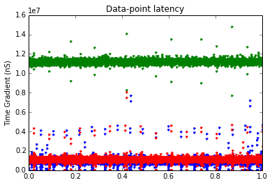
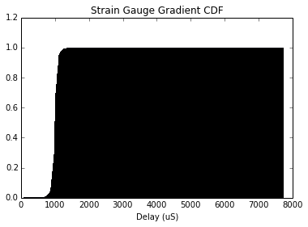
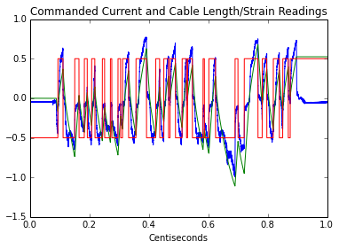



We've gotten good data coming over the CAN network through with beaglebones
acting as ROS nodes.  Here I'm going to take a look at what the data from the
sensors looks like, and more importantly what kind of latencies in the data
tx/rx exist.  This analysis will allow me to begin designing the digital force
contoller for each end-cap of SUPERBall.

    import numpy as np
    import scipy.signal as sp
    import matplotlib.pyplot as plt
    %pylab inline

    Populating the interactive namespace from numpy and matplotlib

First we need to unpack data from the ROS CAN dump into message types.  For the
system ID process, we've set it up to have three message ID's.  One for strain
gauge measurements, one for cable length (read as position), and one for the
commanded current in the system.

The form of each packet is: [Timestamp in nS; Message ID; Floating Point Value;
raw uint32_t]

    data = np.loadtxt("/home/pavlo/Documents/log3.txt", delimiter=';')  
    
    Strain = np.empty([data.shape[0],4])
    Pos = np.empty([data.shape[0],4])
    Curr = np.empty([data.shape[0],4])
    
    Strain = data[np.where(data[:,1]==0)[0],:]
    Pos = data[np.where(data[:,1]==1)[0],:]
    Curr = data[np.where(data[:,1]==2)[0],:]

Next we get the total time elapsed by taking the difference between the last and
the first timestamp, for later use, and compute the one dimensional gradient of
each message type to determine the longest update period.  This value will tell
me how quickly I can update a digital controller with some knowledge that I
won't be trying to close the loop on an old value.

After my systemID work is done, some interpolation can be used to estimate what
the next output will be of the system based off of its current state.  This
would allow me to run the controller a little faster and base the cutoff
frequency off of the a smaller standard deviation rather than through analysis
of a confidence measure which is as close to one as possible.

The strain gauge latency is the only value that really matters, as all other
values which will be used in the ID process are found on the motor-controller
and will be known at every timestamp as long as the motor controller is on and
functioning properly.

    num_rows, num_cols = data.shape
    
    firstStamp = data[0][0]
    lastStamp = data[num_rows-1][0]
    
    # Get the total time elapsed by taking the difference between the
    # last and the first timestamp.
    totalTime = lastStamp - firstStamp
    
    gradStrain = np.gradient(Strain[:,0])
    gradPos = np.gradient(Pos[:,0])
    gradCurr = np.gradient(Curr[:,0])
    
    # convert to seconds
    # It's important to note that the latency of the strain gauge
    # readings is the only measurement that really matters when looking
    # at the maximum viable periodicity of the digital control loop
    # as commanded current and cable lengths are computed on the 
    # motorboard and don't require any CAN communications.
    
    maxStrain = (np.amax(gradStrain)) * .000000001
    maxPos = (np.amax(gradPos)) * .000000001
    maxCurr = (np.amax(gradCurr)) * .000000001
    
    print('Maximum time delay in Strain reading (S): ' + str(maxStrain))
    print('Maximum time delay in Position reading (S): ' + str(maxPos))
    print('Maximum time delay in Curr reading (S): ' + str(maxCurr))
    
    t1 = np.linspace(0, 1, len(gradStrain))
    t2 = np.linspace(0, 1, len(gradPos))
    t3 = np.linspace(0, 1, len(gradCurr))
    
    print("Data Points :: Strain: " + str(len(gradStrain)) + " Pos: " + str(len(gradPos)) + " Curr: " + str(len(gradCurr)))
    
    plt.plot(t1, gradStrain, marker='.', linestyle='none')
    
    plt.plot(t2, gradPos, marker='.', linestyle='none')
    
    plt.plot(t3, gradCurr, marker='.', linestyle='none')
    plt.title('Strain Gauge Time Gradient')
    plt.ylabel('Time Gradient (nS)')
    plt.title('Data-point latency')
    
    plt.show()
    
    plt.title('Strain Gauge Gradient CDF')
    plt.xlabel('Delay (uS)')
    plt.hist(gradStrain/1000, bins=1000, normed=True, cumulative=True)
    plt.show()

    Maximum time delay in Strain reading (S): 0.007724416
    Maximum time delay in Position reading (S): 0.014812032
    Maximum time delay in Curr reading (S): 0.00805184
    Data Points :: Strain: 91785 Pos: 6810 Curr: 68092

Now I'm going to plot interpolated values and filter the strain-gauge data under
the worst-case-scenario conditions to emulate what the system would be like with
a low-pass on the input with a cutoff of (1/maxStrain)/2, or the nyquist cutoff
of the longest update period.

    #Making sure the scaling is correct: here.
    #91.457555/((lastStamp-firstStamp)/1000000)
    #This should equal close to .001 seconds.
    
    interptStrain = np.interp(np.linspace(firstStamp, lastStamp, num=(lastStamp-firstStamp)/1000000), Strain[:,0], Strain[:,3])
    interptPos = np.interp(np.linspace(firstStamp, lastStamp, num=(lastStamp-firstStamp)/1000000), Pos[:,0], Pos[:,3])
    interptCurr = np.interp(np.linspace(firstStamp, lastStamp, num=(lastStamp-firstStamp)/1000000), Curr[:,0], Curr[:,3])
    t4 = np.linspace(0, 1, len(interptStrain))
    
    # Filter the input signal to (1/maxStrain)/2 to account for worst case
    # input latency.
    N=1
    Fc=(1/maxStrain)/2
    print("Frequency cutoff based off of worst case 
    # provide them to firwin
    b, a = sp.butter(N, Fc, btype='low', output='ba')
    
    y = sp.lfilter(b, a, interptStrain)
    
    plt.plot(t4, y/4)
    plt.plot(t4, interptPos/500)
    plt.plot(t4, interptCurr)
    plt.title('Commanded Current and Cable Length/Strain Readings')
    plt.xlabel('Centiseconds')
    plt.show()

Now I output the data to a CSV to be used in MATLAB for system ID.

    output = np.empty([len(interptStrain),3])
    
    output[:,0] = interptStrain
    output[:,1] = interptPos
    output[:,2] = interptCurr
    
    np.savetxt("/home/pavlo/Desktop/output.txt", np.asarray(output), delimiter=",")
